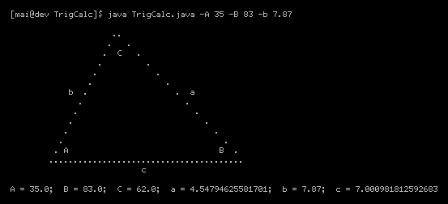
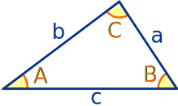

# TrigCalc

### Command line Java program to determine unknown angles and sides of triangles

#### Usage:

**Angles are specified in degrees**

`$ java TrigCalc.java -A 35 -B 83 -b 7.87`

#### Building:

`$ javac TrigCalc.java`

`$ jar cfe TrigCalc.jar TrigCalc TrigCalc.class`

`$ java -jar TrigCalc.jar -A 35 -B 83 -b 7.87`

#### Testing:

`$ javac *.java && java -ea TrigCalcTest`
